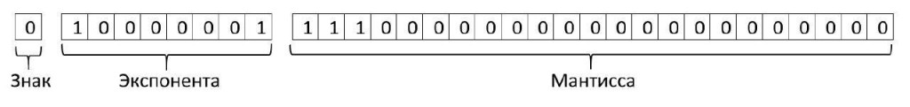

<h1>Основы Python. Целые и вещественные числа</h1> 


## Введение
`Python` – это высокоуровневый язык программирования, который широко используется в различных областях, таких как веб-разработка, машинное обучение, наука о данных и аналитика.
В данном курсе будут рассмотрены:
* особенности программирования на языке Python;
* применение  среды программирования для чтения и отладки кода;
* основы работы с системой управления базами данных;
* процесс написания программного кода в формате проекта.

## Работа с интерпретатором
В файле `main.py` вы можете вводить команды на языке Python с помощью . Результаты вы увидите в консоли справа.


## Математика в Python

Разберем первую простую команду. Выведем на экран сумму двух чисел.
```Python
print(2 + 2)
```
Чтобы вывести результат вычисления в консоль необходимо ввести `print()` и в скобочках указать операцию для вывода на экран.<br>
<br>
Python можно использовать как обычный калькулятор, записав операции сложения, вычитания, умножения и деления.

```Python
print('Сумма:', 2 + 2)
print('Разность:', 2 - 2)
print('Произведение:', 2 * 2)
print('Частное:', 2 / 2)
```

В отличии от многих других языков программирования нам не нужно ничего определять предварительно перед совершением операции, что упрощает запись кода.

### Комментарии

Если нам необходимо записать текст, который интерпретатор Python не будет считывать как код, то в этом нам помогут комментарии. Комментарии начинаются с символа "`#`" и продолжаются до конца строки. Пример:

```Python
# Это однострочный комментарий
print("Hello, World!")
```

Комментарии помогают разработчикам и читателям кода понять назначение определенных частей кода, а также дают возможность временно отключать части кода во время отладки.

### Типы данных

Обратите внимание на результат операции деления. Не смотря на то, что число делится нацело, результат выглядит как десятичная дробь. Это нам говорит о том, что **тип данных** при разных операциях будет отличаться.<br>

```Python
print(2 * 2)  # <class 'int'>
print(2 / 2)  # <class 'float>
```
Программы в Python выполняют обработку информации. Компьютер воспринимает любую информацию как поток байтов, однако для удобство восприятия данных человеком, выделяются абстракции.
Такими абстракциями выступают **типы данных** – представление полученной информации с заданными свойствами.
Результатом той или иной операции является данные, представленные конкретным типом.

| Название | Обозначение |
| :--- | :--- |
| int | целые числа |
| float | вещественные числа |
|bool | логический тип данных |
| str | строки |
| list | списки |
| tuple | кортежи |
| dict | словари |
| set | множества |
| и др.||

Типами данных в Python представлены целые числа `int` и вещественные числа `float`.
* Целые числа включают в себя все положительные, отрицательные числа и нуль.
* Вещественные числа включают в себя положительные и отрицательные числа. Float состоит из экспоненты и мантиссы. [Подробнее по ссылке](https://docs-python.ru/tutorial/operatsii-chislami-python/problemy-chisel-plavajuschej-zapjatoj/).

Float имеет разные формы записи.
```Python
200      # int
-100     # int
0        # int
50.0     # float
13.5012  # float
1e+7     # float
```
### Встроенные функции в Python

Узнать тип данных, вывести в консоль, узнать длину объекта и многое другое можно с помощью **встроенных функций**. <br>
<br>
Если **типы данных** – это представление информации, то **функции** – это инструменты для обработки этой информации. 
Python выделены набор встроенных функций, которые позволяют делать основные операции с типами данных.
Для того, чтобы «вызвать» функцию, нужно написать определенное ей имя и в скобках после передать аргументы – данные для обработки.

| Название | Обозначение |
| :--- | :--- |
| `print(x, y, z)` | вывести в консоль. <br>_Интерпретатор позволяет выводить значения без функции print, однако для вывода результата в консоль через файлы с расширением .py необходимо использовать print_ |
| `type(x)` | вернуть тип данных |
| `round(x, n)` | округлить float до целой части или до указанного значения после запятой |

### Приведение к типу данных

Существуют операции, которые позволяют переводить одни типы данных к другим.
Например, целое число `int` можно превратить в `float` (то есть 1 --> 1.0). И наоборот.
Например, при подстановке в тип данных bool единицы получим True. При подстановке нуля – False. Об этом подробнее в следующем разделе.

```Python
int(10.105)  # 10
float(105)   # 105.0
bool(1)      # True
```

## Особенности темы
### Вопрос 1.
Каким будет результат выполнения кода ниже?

```Python
print (9//2)
# 4.5
# 4.0  
# 4    <- правильно
# Error
```
**Обратите внимание! Пробелы**
<br>
Представим, что операция записана следующим образом:

```Python
print((2**4124)/224+532*23/(214**2))
```

Прочитать это затруднительно, поэтому следует придерживаться следующих правил:

```Python
# 1. используем пробелы между операндами. 
print(500 ** 2 + 100, 100 // 25)  

# 2. можно разносить параметры функции по строкам
print(
    500 ** 2 + 100, 
    100 // 25
    )
    
# 3. Между функцией и скобочкой пробел не желательно использовать.
print(type(len([1, 2, 3])))
```
    
### Вопрос 2.
Каким будет результат выполнения кода ниже?

```Python
print(30.0//3)
# 10.0  <- правильно
# 10 
# 100   
# Error
```
**Обратите внимание! Операции с float**
<br>
Если один из операндов имеет тип данных float, то и ответ будет float. Но, при этом деление нацело работает.

```Python
print(27.3 / 5)    # 5.46
print(27.3 // 5)   # 5.0
```

### Вопрос 3.
Каким будет результат выполнения кода ниже?

```Python
print(round(12.5) - round(11.5))
# 0  <- правильно
# 1
# 2
# Error
```

**Обратите внимание! банковский метод округления**
<br>
При арифметическом округлении в большую сторону округляются 5,6,7,8,9, в меньшую 1,2,3,4.
Однако, в реальности мы работаем не со случайным набором чисел, а с конечным. Таким образом, выходит, что больше чисел округляется вверх. Случайная ошибка такого подхода при случайной выборке довольно высока.<br>
Решением является **банковский метод** округления числа к ближайшему четному числу. Данный метод реализован в Python 3.

### Вопрос 4.
Каким будет результат выполнения кода ниже?

```Python
print(0.1 + 0.2 == 0.3)
# True
# False  <- правильно
# Зависит от интерпретатора языка
# Error
```

**Обратите внимание! потеря точности**
<br>
Так как ни 0.1, ни 0.2, ни 0.3 нельзя точно представить в двоичном виде, накапливается большое количество ошибок в промежутке от 0.1 до 0.2. В итоге между (0.1 + 0.2) и 0.3 существует разница в 5.5511e-17.
Более того, для хранения обычного числа int можно выделить 4 байта. Но как компьютер должен хранить число, у которого есть целая часть и дробная? Ведь бывают иррациональные дроби (1.1(6)) и, если человек может представить такое число, то как его поместить в памяти компьютера? Поэтому, было придуман следующий шаг. 



Дробное число состоит из экспоненты и мантиссы. Экспонента (целая часть) занимает 4 байта, мантисса (дробная часть) тоже занимает 4 байта. Целую часть записывается как обычное целое число, а для дробной части выделяется диапазон из 4 байт, которого достаточно, чтобы передать точность до 8 знака. Но то что после, хранить в памяти не обязательно. По этой причине при проведении математических операций с типом данных float, падает точность. 

### Вопрос 5.
```Python
# Чему будет равно ~~~~~~5?
# +5  <- правильно
# -11
# +11
# -5
```
**Обратите внимание! бинарные операторы**
<br>

### Вопрос 6.
```Python
print(int(21) + float(21) * 0)
# 21
# 0
# 21.0  <- правильно
# 0.0
```

**Обратите внимание! Приведение к типу данных**
<br>

### Вопрос 7.
```Python
print(
    (2 * 4) % 3,
    3 * 2 % 3,
    5 * (1 % 3),
)
# 0 0 5
# 2 1 5
# 2 0 5  <- правильно
# Error
```

**Обратите внимание! Последовательность операций**
<br>