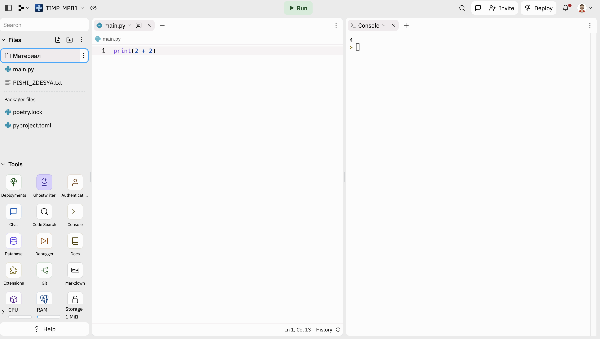

<h1>Основы Python. Переменные и строки</h1> 


На прошлом занятии рассмотрели основы математических операций в python и ответили на каверзные вопросы.

## Работа с интерпретатором
В файле `main.py` вы можете вводить команды на языке Python с помощью . Результаты вы увидите в консоли справа.



## Переменные в Python

Представьте себе, что вам надо вычислить следующие операции:

```Python
print(((20 * 5)**2 ) / (1004**2 + 500**4))
```

Если мы хотим в дальнейшем использовать результат этого вычисления, то нам необходимо данную формулировку записать заново, что неудобно. Поэтому мы можем закрепить за результатом вычисления конкретное имя, то есть присвоить результату данного выражения **переменную**.

```Python
result = ((20 * 5)**2 ) / (1004**2 + 500**4)
print(result)  # переменная ссылается на результат вычисления
print(result ** 2)  # результат можно использовать в других вычисления через переменную
```

**Переменные в Python** - это ярлыки, которые вы можете прикрепить к данным. Например, вы можете создать переменную с именем `age` и прикрепить ее к числу 18, означающий возраст. Позже, если вы захотите использовать это число, вам не нужно будет помнить само число, вы можете просто использовать переменную `age`, и Python скажет вам, что в ней хранится. Переменные помогают вам управлять и хранить информацию в вашей программе.

## Правила создания переменных в Python
При создании имен переменных необходимо придерживаться нескольких правил.<br>
**Название переменной должно:**
* начинаться с буквы
* быть записано маленькими латинскими буквами;
* быть разделено нижним подчеркиванием "`_`", если в названии переменной несколько слов;
* отображать, какой объект за переменной находиться (иметь семантическую связь).

Рассмотрим примеры:
```Python
# 1. Можно называть:
age_in_years = 34  # возраст в годах
weight = 50        # вес
id = 123           # идентификатор
_id = 321          # может начинаться с символа "_"
_ = 1              # даже только "_" 
Age = 4
age = 3            # регистр имеет значение!

# а также,
Low = 2            # вместо буквы "l" в переменной может использоваться "L", чтобы не путать похожие символы 
PATH = 'https://www.google.com'  # среди переменных выделяются константы - переменные, значения которых не следует менять, но менять их все еще можно. 

# 2. Нельзя называть:
# 1Xbet = 777 - нельзя! переменная должна начинаться с буквы или нижнего подчеркивания
# cost_function = 'Николай' – отсутствует семантическая связь!
```

## Особенности темы. Блок 1
### Вопрос 1.
Какую из перечисленных переменных нельзя использовать в Python?
```Python
# Myvar
# my_var
# _myvar
# my-var  <- правильно
```
**Обратите внимание! Названия имен переменных, такие как нельзя использовать символ "-"**
<br>
### Вопрос 2.
Каким будет результат выполнения кода ниже?
```Python
fvar, svar, tvar = 5, 10, 15
print(fvar, svar, tvat)
# 5, 10, 15
# 5 10 15  <- правильно
# (5, 10, 15), (5, 10, 15), (5, 10, 15)
# Error
```
**Обратите внимание! Множественное присвоение**
<br>
Можно определить сразу несколько переменных.
```Python
x, y, z = 4, 7, 9
print(z, x, y)

# но учтите, 
# a, b, c = 2, 5 – Ошибка! Недостаточно значений для распаковки.
```

### Вопрос 3.
Каким будет результат выполнения кода ниже?
```Python
var = 5 * (5 // 2)
печатай = print
печатай(var)
# 12.5
# 10  <- правильно
# 0
# Error
```
**Обратите внимание! Имена объектов в Python**
<br>

## Строки в Python
### Объявление строк

Кроме числовой информации, Python может обрабатывать символьную информацию.

```Python
print('Hello World!')
```

Строки, как и числа, можно записывать в переменные. Обратите внимание на употребление кавычек. Имена переменных fword и sword можно представить как first_word, second_word.

```Python
fword = 'hello'
sword = "hello"
symbols = '1124'  # числа можно записать как строки str.
```

Для чего используются двойные кавычки? Если внутри строки присутствуют еще одни кавычки, то интерпретатор Python сформирует строку по ним, что приведет к ошибке. Для решения этой проблемы можно использовать двойные внешние кавычки, а внутри строки строки использовать одинарные, или наоборот. В качестве альтернативы, можно использовать управляющий символ экранирования "`\`", чтобы Python не считывал кавычку, как завершение строки.

```Python
print("Стоит, 'груши околачивает'👵")
# или
print('Стоит, \'груши околачивает\'👵') 
```

Часто можно встретить следующую запись.

```Python
word = '''
Скажи-ка, дядя, ведь недаром
Москва, спаленная пожаром,
Французу отдана?'''
```

Может показаться, что это многострочные комментарий и его действительно можно так использовать. Такой комментарий будет называться блочным. Блочные комментарии начинаются с комбинации символов `'''` или `"""` и заканчиваются соответствующей комбинацией. Все, что находится между этими кавычками, считается комментарием. Пример:

```Python
'''
Это блочный комментарий
'''
print("Привет, Мир!")
```

Тем не менее, предназначение такой конструкции иное. Тройные кавычки используются для документирования функции, о чем мы поговорим в следующих темах. Согласно ответу на форуме [stackoverflow](https://ru.stackoverflow.com/questions/457732/Многострочные-комментарии-в-python) такой хак предлагает использовать и создатель языка Python, но руководство по стилю кода pep-8 рекомендует использовать символ "`#`" для блочных комментариев.

### Индексация строк
Объявим переменную greeting, которая будет хранить строку.

```Python
greeting = 'Hello World!'
```

Строку можно представить как набор символов. Следовательно, из строки можно получить один или несколько символов. Для этого в Python используются индексы. Индексы в Python - это способ обращения к отдельным элементам строки или другим итерируемым объектам. Представим строку, как набор индексов – порядковых номеров символов в строке.

H  |e  |l  |l  |o  |   |W  |o  |r  |l  |d  |!  |строка
:- |:- |:- |:- |:- |:- |:- |:- |:- |:- |:- |:- |:-
0  |1  |2  |3  |4  |5  |6  |7  |8  |9  |10 |11 |индексы
-12|-11|-10|-9 |-8 |-7 |-6 |-5 |-4 |-3 |-2 |-1 |отрицательные индексы|

Когда вы создаете строку, вы можете получить доступ к каждому отдельному ее элементу, используя соответствующий индекс. 

```Python
# 1. получить символ "H"
print(greeting[0])

# 2. получить символ "W"
print(greeting[6])
print(greeting[-6])
```
Здесь 0 - это индекс первого элемента строки greeting. Если вы хотите получить доступ ко второму элементу, вы должны использовать индекс 1, и так далее. В Python, индексы начинаются с 0, поэтому первый элемент строки имеет индекс 0. Также стоит отметить, что индексы могут быть отрицательными, в этом случае они отсчитываются с конца строки. Например, если у вас есть строка из 5 символов, то -1 будет индексом последнего элемента, -2 - предпоследнего и т.д.

Узнать количество символов в строке можно с помощью функции `len()`. Не забывайте, что функции можно использовать совместно, так как необходимо обращать внимание на результат каждой операции по отдельности.

```Python
print(len(greeting))  # 12
```

Срез строки в Python позволяет получить часть строки, начиная с определенного символа и до определенного символа. Срез строки выглядит следующим образом:

```Python
# 3. получить срез "Hello"
print(word[0:5])
# или
print(word[:5])

# 4. получить срез "World"
print(word[6:])
# или
print(word[-6:-1])

# можно сложить срезы строк
print(word[:5] + word[6:]) # HelloWorld
```

Если начальный или конечный индексы не указаны, то срез делается с начала или до конца строки. Если начальный индекс больше, чем конечный, то выводится ошибка. 

В Python, когда вы делаете срез строки, вы можете указать шаг, который определяет, сколько символов нужно пропустить после каждого взятого символа. Например, если вы хотите взять каждый второй символ из строки, вы можете использовать следующий код:

```Python
# шаг среза
print(word[::2])  # HloWrd
```

Также в качестве шага можно использовать как отрицательные значения. Тогда, строка будет отображена наоборот.

```Python
# 5. отобразить строку наоборот
print(word[::-1])  # !dlrow olleH
# или
print(word[0:len(word):-1])
```

## Особенности темы. Блок 2
### Вопрос 4.
Каким будет результат выполнения кода на изображении?
```Python
string = '0 1 2'
print(
    string * 2,
    string * 0, 
    string * -1,
    )
# 0 2 4 0 0 0 0 -2 -4
# 0 2 4 0 0 0
# 0 1 2 0 1 2 <- правильно
# Error
```
**Обратите внимание! Мультипликация строк.**
<br>
Со строками можно совершать различные операции. Например, сложение и вычитание. При использовании *2 к строке, мы получаем дублирование строки. Так, '0 1 2 ' превращается в '0 1 2 0 1 2 '. При использовании *0 к строке, мы получаем пустую строку. При использовании *-2 к строке, мы не получаем ничего. Эта команда просто не работает, но при этом и ошибку она не выдаёт.

### Вопрос 5.
Каким будет результат выполнения кода на изображении?
```Python
text = 'Доброго дня всем'
print(a[-1] + a[0])
# мд
# мД <- правильно
# Дм
# Error
```
**Обратите внимание! Конкатенация строк**
<br>

### Вопрос 6.
Каким будет результат выполнения кода на изображении?
```Python
varInt = 2000
varStr = '23'
print(varInt + varStr)
# 200023
# 2023
# [2000, '23']
# Error <- правильно
```
**Обратите внимание! Сложение str и int**
<br>
varInt – переменная типа int, а varStr – string, потому мы не можем просто объединить целое число со строкой. Сначала мы должны привести их к одному типу (int или string), после чего уже можно будет провести сложение.


